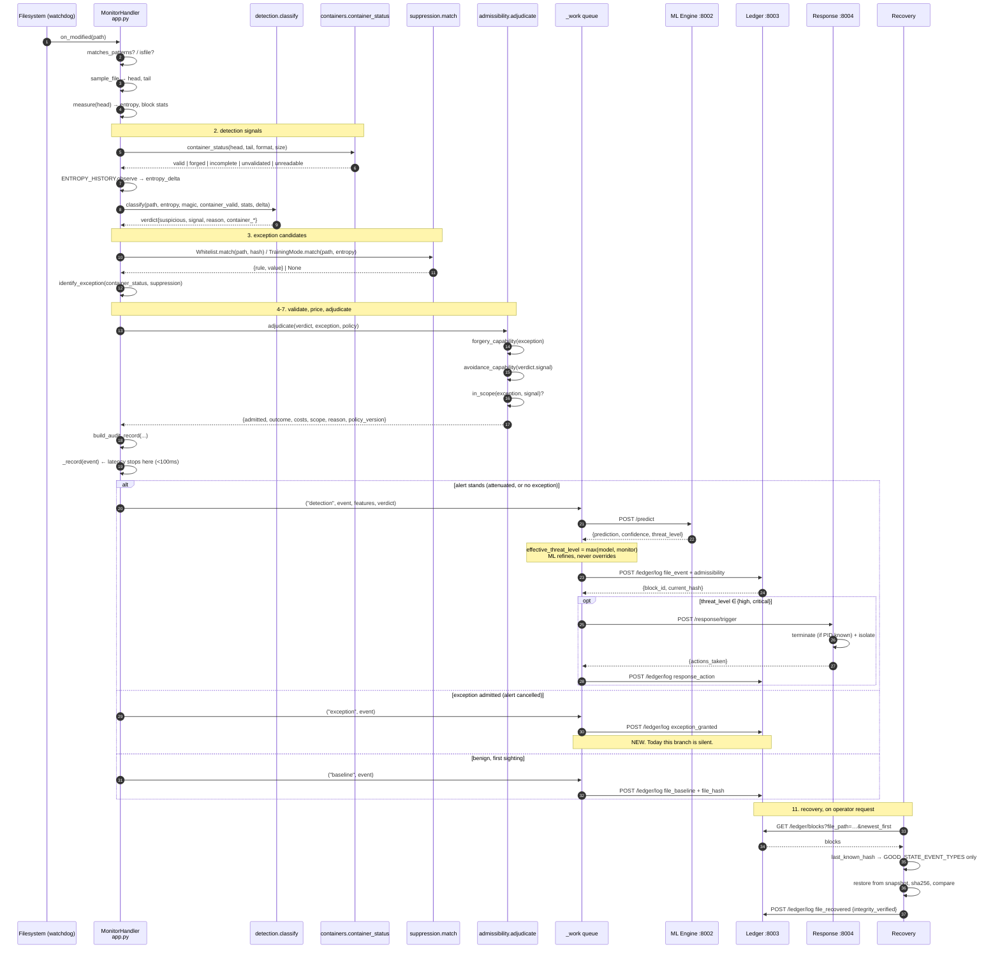
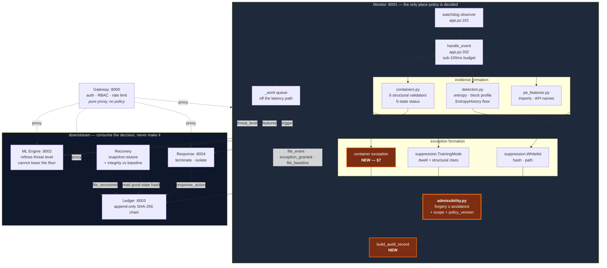

# Capability-governed exception admissibility in URDS

*Design and implementation plan, grounded in `feat/detection-hardening` as it stands at
`fba11bf`.*

**Read this first.** The idea in the brief — *an exception may cancel an alert only when
forging the exception costs at least as much as avoiding the detection* — is **already
implemented on this branch**, in `services/monitor/admissibility.py`, with exactly the rule
the brief specifies:

```python
admitted = forging_capability >= avoidance_capability
```

Pretending otherwise would be the easiest way to write an impressive-looking document and the
fastest way to lose a viva. What follows therefore separates three things throughout:

| Marker | Meaning |
|---|---|
| **EXISTS** | on this branch now, with tests, at the file and line cited |
| **GAP** | genuinely missing, and the reason it is missing is stated |
| **NEW** | code this document proposes adding |

There are seven gaps. The largest one is the subject of §7 and it is the specific thing the
brief's example — *a high-entropy file with a recognised but invalid or unvalidated container
header* — actually lands on: **the container exemption is the one exception in the system that
does not go through the admissibility layer at all.** It is an inline early return in
`detection.py:702`. It grants itself, it records nothing, and its ordering relative to the
other signals is hand-written control flow rather than a priced comparison — which is
precisely the class of defect `admissibility.py` was written to abolish.

---

## 1. Executive explanation

A detector needs escape hatches. Without them a ZIP of holiday photos and an AES-encrypted
spreadsheet look identical — both sit at ~7.99 bits/byte — and the detector either alerts on
every archive or on nothing. So URDS has three escape hatches: an operator whitelist, a
learned training-mode baseline, and the container exemption (*high entropy that a declared
compressed format explains is compression, not encryption*).

Every escape hatch is a hole in the detector. The question is not whether to have them, it is
**how much it costs an attacker to climb through one**.

That is the whole idea:

> Each detection signal has an **avoidance cost** — what an attacker must spend to not trigger
> it. Each exception has a **forgery cost** — what an attacker must spend to make it fire on a
> file they control. An exception may cancel a detection only when forging the exception costs
> at least as much as avoiding the detection. Otherwise the exception is the cheap way in, and
> a rational attacker takes it.

Ordering is by **cost, not severity**. A `.locked` extension is the loudest signal in the
system and the cheapest to avoid — don't rename the file — so it ranks lowest. A SHA-256
whitelist entry is the most permissive rule in the system and the most expensive to forge — it
needs a preimage — so it ranks highest, and it *should* outrank everything, because a file
whose bytes hash to an approved value **is** the approved file.

### The worked example from the brief

A file arrives at 7.99 bits/byte whose first four bytes are `PK\x03\x04`.

**Case A — validated.** `services/monitor/containers.py` walks it: local file header, a
compression method inside APPNOTE's set, a central directory, an end-of-central-directory
record. `container_valid = True`. Forging this exception means *shipping a working ZIP
encoder and leaving real archive structure in the output* — cost **MODERATE**. It cancels the
high-entropy signal, whose avoidance cost is NEGLIGIBLE. Verdict: benign. Correct, and this is
the false-positive mitigation earning its keep.

**Case B — invalid.** The four bytes are there and nothing behind them parses.
`container_valid = False`. This is not a weak exception, it is *evidence*: the file is lying
about what it is. It becomes the `structural_mismatch` signal, which costs MODERATE to avoid.
Verdict: `suspected_encryption`. This is the `spoofer` simulator family, which went 0-for-8
before `containers.py` existed and is caught 8-for-8 now.

**Case C — unvalidated.** The header says `Rar!\x1a\x07`, or `7z`, or `BZh`, or `\xfd7zXZ`.
URDS recognises seventeen container families and has structural validators for six.
`container_valid = None` — *unknown*, which is not the same as valid. Forging this exception
costs **four bytes**: NEGLIGIBLE. Today, that four-byte exemption is granted silently and
leaves no record anywhere. Under the proposal it is still granted (see §7 — refusing it would
manufacture a false positive on every RAR on the machine), but it is granted **on the
record**, priced `container_unvalidated / negligible`, written to the ledger, and visible to
an operator as a known-weak exception rather than as an absence of evidence.

The difference between C-today and C-proposed is not the verdict. It is that today the system
cannot tell you it made a decision at all.

---

## 2. Existing architecture mapping

| Service / file | Existing responsibility | New responsibility | Required change |
|---|---|---|---|
| `services/monitor/detection.py` | **EXISTS.** Entropy, block-entropy profile, byte statistics, magic-byte identification (17 families), ransom-extension list, `EntropyHistory` differential baseline with a session floor. `classify()` (l. 586) emits five signals: `entropy_rise`, `structural_mismatch`, `partial_entropy`, `static_entropy`, `ransom_extension`. | Stop *deciding* the container exemption. `classify` should report `static_entropy` and hand the container explanation up as an **exception candidate**, not consume it in an early return. | **NEW.** Replace the early return at l. 702 with `identify_exception()`. `classify`'s five signals and their reasons are unchanged. ~25 lines. |
| `services/monitor/suppression.py` | **EXISTS.** `Whitelist.match` (l. 140) → `hash` \| `path`; `TrainingMode.match` (l. 418) → `training_mode`. Matching only — the module docstring is explicit that ranking lives elsewhere. Dwell requirement (`TRAINING_DWELL_SECONDS`) and structural-class keying against ceiling poisoning. | Unchanged. It already returns `{"rule", "value"}` records, which is the shape `adjudicate` consumes. | **None.** This module is correct as written. |
| `services/monitor/admissibility.py` | **EXISTS, and is the core of the brief.** `AVOIDANCE_COST` for 5 signals, `FORGERY_COST` for 3 rules, four-point ordinal scale, `UNKNOWN_AVOIDANCE = HIGH` / `UNKNOWN_FORGERY = NEGLIGIBLE`, `adjudicate()` (l. 128) with `admitted = forging >= avoiding` (l. 147), attenuation rather than silent discard. | Own the container exception too. Add a **scope** axis (§7), two container rules to `FORGERY_COST`, a `POLICY_VERSION`, and an `UNPRICED` sentinel that makes the docstring's fail-closed promise true (§4.9). | **NEW.** ~60 lines added, no existing line deleted. Still the only place the decision is made. |
| `services/monitor/containers.py` | **EXISTS.** Six structural validators (zip, gzip, png, jpeg, pdf, iso-bmff), bounded walks (`MAX_WALK_RECORDS`, `MAX_WALK_BYTES`). Five-state `container_status` → tri-state `validate_container`. `VALIDATED_FORMATS` is exported so the coverage gap is stated rather than implied. | Expose the *status* (not just the tri-state) to the audit record, so `incomplete` and `unreadable` are distinguishable from `unvalidated` in the ledger. | **NEW.** `handle_event` calls `container_status` once and derives the tri-state from it, instead of calling `validate_container`. ~5 lines. |
| `services/monitor/app.py` | **EXISTS.** `handle_event` (l. 332) is the integration point: `classify` → `WHITELIST.match or TRAINING_MODE.match` → `adjudicate` (l. 425) → event carries `signal`, `suppressed_by`, `admissibility` (l. 468), `container_valid`. Sub-100ms budget measured over exactly this function. | Build the exception candidate from the container status as well as from the two suppression sources, and stamp the audit record. | **NEW.** `adjudicate` gains a second candidate source; `build_audit_record` is factored out of the inline dict. ~30 lines. |
| `services/monitor/pipeline.py` | **EXISTS.** Fan-out ML → ledger → response. Already propagates `admissibility` into `event_data` (l. 192). `effective_threat_level` (l. 43) takes `max(model, monitor)` so **ML cannot lower the Monitor's floor** — the brief's requirement 9 is already satisfied and tested. | Emit a ledger record for a **granted** exception too, not only for events that reach the suspicious path. | **NEW.** New `exception_granted` event type on the benign branch, queued. ~20 lines. |
| `services/ml-engine/` | **EXISTS.** `features.py::_structural_validity` already maps the tri-state to +1 / 0 / −1 and documents why absent must be 0 and not −1. `partition()` reports unscored features. `app.py::predict` returns `threat_level`. | **None — deliberately.** The brief forbids real-time admissibility logic here and the branch already respects that: the ML engine never sees an admissibility record. | **None.** Consume `admissibility` as read-only context in `/predict`'s response echo if desired; do not branch on it. |
| `services/ledger/` | **EXISTS.** Append-only SHA-256 chain (`hash_chain.py`), `verify_chain`, `/ledger/blocks` with `file_path` filter and `newest_first`. `event_data` is opaque JSON, so admissibility records already persist without a schema change. | Accept two new `event_type` values. Nothing structural. | **NEW.** Add `exception_granted` to the recognised set for reporting; the chain itself needs no change. ~5 lines, plus one test. |
| `services/response/` | **EXISTS.** `/response/trigger` acts on `threat_level in {high, critical}`; `actions.py` guards against terminating self/ancestors; isolation is planned-not-enforced where the platform cannot. | **None.** The Monitor's decision arrives as a threat level, which is the correct coupling. | **None.** |
| `services/response/recovery/` | **EXISTS, and is where the same principle was first applied.** `ledger_client.last_known_hash` (l. 98) takes the newest hash from `GOOD_STATE_EVENT_TYPES` — an *allowlist*, because the newest hash on an attacked path is the attacker's. `recovery.py::_recover_one` reports `integrity_verified` honestly, including "could not verify". | Prefer a baseline whose *own* event carries an admitted-exception record over one that does not — a file that was benign only because a `path` whitelist said so is a weaker baseline than one that was benign on its measurements. | **NEW.** One ranking predicate in `last_known_hash`. ~15 lines. Optional; state it as future work if the evaluation budget is tight. |
| `services/gateway/` | **EXISTS.** Auth, RBAC (`require_role`), rate limiting, pure proxying (`routers/monitor.py`, `routers/ledger.py`). | **None.** No policy at the edge. | **None.** New read-only route `GET /monitor/policy` proxied through, admin-gated. ~10 lines. |
| `scripts/ransomware_simulator.py` | **EXISTS.** Thirteen families including `spoofer` (header over ciphertext at an unseen path), `grinder` (window flush behind a header), `poisoner` (live ceiling poisoning), `strider` (strided intermittent). All 13 detected, all `--restore` round-trip. | Two families: `impostor` (an *unvalidated* format's magic — `Rar!`, `7z` — over ciphertext) and `artisan` (a **structurally valid** ZIP wrapping ciphertext). | **NEW.** ~40 lines. `artisan` is the family that tests the scope axis in §7 and nothing on this branch currently probes it. |
| `services/monitor/tests/` | **EXISTS.** 467 tests across five services. `test_suppression.py` asserts through `adjudicate` (l. 57, 114); `test_tc13_suppression_e2e.py` covers whitelist/training end-to-end; `test_detection.py` covers the container and entropy paths. | Equal-cost ties, unpriced-rule fail-closed, container-as-exception, three-arm comparison. | **NEW.** ~18 tests, listed in §8. |

### What is *not* in the table, because it does not exist

* **`policy_version`** — **GAP.** The string appears nowhere in the repository. Every
  admissibility record on this branch is unversioned, so a ledger entry from before a cost
  table edit is indistinguishable from one after it. For an audit claim this is the single
  cheapest gap to close and the most damaging to leave open.
* **A record for a *granted* exception** — **GAP.** `pipeline.run` is only called on the
  suspicious branch (`app.py:502`). An exception that *cancels* an alert therefore produces
  no ledger entry at all. Refusals are audited; grants are not. Audit completeness is
  currently asymmetric, and the asymmetry runs the wrong way.
* **A scope/competence axis** — **GAP.** See §7.
* **A three-arm comparison harness** — **GAP.** `scripts/simulator_sweep.py` measures one
  configuration. The brief's three groups need a switch.

---

## 3. Proposed microservice architecture

No new services. The runtime is the five that exist — Gateway (8000), Monitor (8001), ML
Engine (8002), Ledger (8003), Response + Recovery (8004) — and the change is entirely inside
the Monitor's process boundary. That is not modesty, it is a requirement: the admissibility
decision must be **synchronous with detection** and must complete inside the sub-100ms budget
`handle_event` is measured against. A network hop to a policy service would blow that budget
and would create a failure mode where the policy service being down means either fail-open
(unacceptable) or no detection at all (worse).

**Threading, unchanged.** Watchdog delivers events on its own thread; classification and
adjudication run inline on that thread; the fan-out to ML, Ledger and Response is handed to a
worker via `_work` (`app.py:129`) so a slow ledger cannot stall the watcher.

### 3.1 Sequence



Steps 9 and 10 of the brief are worth calling out because the branch already gets them right.
**ML classification is added without overriding the Monitor's evidence governance**:
`pipeline.effective_threat_level` (l. 43) returns `max(model_threat_level, monitor_floor)`, and
the docstring records the measurement that forced it — the behavioural model scored "low" on
every 4 KB, 8 KB and 32 KB in-place encryption because its operating point needs ~7.995 bits/byte
and small ciphertext cannot reach that through sampling noise. The ML engine never sees the
admissibility record and never gets a vote on it.

### 3.2 Components and data flow



---

## 4. Detailed algorithm

Notation: `EXISTS` marks pseudocode that transcribes code already on the branch; `NEW` marks
proposed code.

### 4.1 `detect_signals(file_event)` — EXISTS as `detection.classify`, `detection.py:586`

Five signals, checked in a fixed order. The order matters and is documented in the source: the
signals that survive a forged header are checked first.

```
function detect_signals(path, entropy, magic, container_valid, statistics,
                        entropy_delta, threshold = 7.5, readable):

    container   = identify_container(magic)          # 17 families
    ransom_ext  = extension(path) ∈ RANSOM_EXTENSIONS
    high        = entropy >= threshold               # 7.5 bits/byte
    partial     = looks_partially_encrypted(statistics)

    # (0) No bytes. A third outcome, not a benign one.
    if not readable:
        if ransom_ext: return verdict(SUSPICIOUS, "suspicious_extension", signal="ransom_extension")
        return verdict(NOT_SUSPICIOUS, "unreadable", signal=None, entropy=None)

    # (1) Differential entropy. Survives a forged header AND a real one.
    if entropy_delta >= 2.0 and entropy >= 7.0:
        return verdict(SUSPICIOUS, "suspected_encryption", signal="entropy_rise")

    # (2) Structural mismatch. The header is a lie.
    if container and container_valid is False and (high or partial):
        return verdict(SUSPICIOUS, "suspected_encryption", signal="structural_mismatch")

    # (3) Intermittent encryption. Whole-file entropy is an average; the blocks are not.
    if not high and partial and container_valid is not True:
        return verdict(SUSPICIOUS, "suspected_encryption", signal="partial_entropy")

    # (4) --- TODAY: the container exemption is decided HERE. See §7. ---
    #     if high and container and container_valid is not False and not ransom_ext:
    #         return verdict(NOT_SUSPICIOUS, "benign_compressed", signal=None)
    #     NEW: delete this branch. Fall through to (5) and let the exception layer decide.

    if high:
        return verdict(SUSPICIOUS, "suspected_encryption", signal="static_entropy")

    if ransom_ext:
        return verdict(SUSPICIOUS, "suspicious_extension", signal="ransom_extension")

    return verdict(NOT_SUSPICIOUS, "benign", signal=None)
```

### 4.2 `identify_exception(file_event, verdict)` — NEW, `admissibility.py`

Today this logic is split three ways: `Whitelist.match`, `TrainingMode.match`, and an `if`
inside `classify`. Unifying it is the change.

```
function identify_exception(path, file_hash, entropy, verdict,
                            container_status, whitelist, training_mode):

    # Precedence: strongest claim first. A content hash is exact — the bytes ARE
    # the approved file's bytes — so nothing weaker should shadow it.
    match = whitelist.match(path, file_hash, verdict)          # {rule: hash|path}
    if match is None:
        match = training_mode.match(path, entropy, verdict)     # {rule: training_mode}
    if match is not None:
        return match

    # NEW: the container explanation, as a candidate rather than a decision.
    # Only offered when the file actually declares a container. A forged one is
    # NOT an exception — detect_signals already turned it into evidence at (2).
    if verdict.container_format is not None:
        if container_status == VALID:
            return {rule: "container_validated",   value: verdict.container_format,
                    container_status: "valid"}
        if container_status in (UNVALIDATED, INCOMPLETE):
            return {rule: "container_unvalidated", value: verdict.container_format,
                    container_status: container_status}
        # FORGED and UNREADABLE offer nothing. FORGED is evidence; UNREADABLE
        # means no measurement was taken, and an exception built on no
        # measurement is the definition of an unearned one.

    return None
```

### 4.3 `validate_exception_evidence(exception, file_metadata)` — partly EXISTS

The validators exist (`containers.py`, six formats, bounded walks). What is new is treating
their *outcome* as the exception's evidence rather than as a detector input.

```
function validate_exception_evidence(exception, head, tail, size):
    switch exception.rule:

      case "hash":
          # Re-derived, not trusted from the event. sha256_file already ran on
          # the detection path; assert it is 64 hex chars and non-null.
          return VALID if is_sha256(exception.value) else UNVERIFIABLE

      case "path":
          # A path is not evidence about content. It is verifiable only as
          # "the operator wrote this pattern", which is why it prices LOW.
          return VALID if exception.value ∈ whitelist.paths else UNVERIFIABLE

      case "training_mode":
          # The ceiling's provenance: was it learned from paths that satisfied
          # the dwell requirement, keyed by the same structural class?
          return VALID if ceiling.dwell_satisfied and ceiling.structure == structure_of(verdict)
                 else UNVERIFIABLE

      case "container_validated":
          status = container_status(head, tail, format, size)   # re-runs the walk? NO —
          # reuse the status computed once in handle_event. Two walks would double
          # the tail read on the latency path for no new information.
          return VALID if status == "valid" else UNVERIFIABLE

      case "container_unvalidated":
          # Honest answer: there is no validator for this format. The evidence is
          # *absent*, not *bad*. That is a real state and it is what prices the
          # exception NEGLIGIBLE — it is not a failure of this function.
          return UNVALIDATED

      default:
          return UNVERIFIABLE       # fail closed — see 4.9
```

`UNVERIFIABLE` is not the same as `UNVALIDATED`. `UNVERIFIABLE` means the exception claimed
something checkable and the check did not hold — it is downgraded to `UNPRICED` and cancels
nothing. `UNVALIDATED` means the exception claimed something for which no checker exists — it
keeps its (low) price and is recorded as such.

### 4.4 `calculate_forgery_capability(exception)` — EXISTS + NEW rows

```
FORGERY_COST = {
    "hash":                  HIGH,        # EXISTS — a SHA-256 preimage. Not available.
    "path":                  LOW,         # EXISTS — write into an approved directory.
    "training_mode":         LOW,         # EXISTS — get a file counted into the baseline.
    "container_validated":   MODERATE,    # NEW — ship an encoder that emits real structure.
    "container_unvalidated": NEGLIGIBLE,  # NEW — four magic bytes.
}
UNPRICED = -1                             # NEW — see 4.9. Today this is NEGLIGIBLE, which is a bug.

function calculate_forgery_capability(exception):
    if exception is None:                    return UNPRICED
    if exception.evidence == UNVERIFIABLE:   return UNPRICED
    return FORGERY_COST.get(exception.rule, UNPRICED)
```

Why `container_validated` is MODERATE and not HIGH: an attacker *can* ship a ZIP encoder. It
costs them a real encoder, real framing, and a file that still is the format — the same order
of work as emitting a genuinely valid container, which is the definition of MODERATE on this
scale ("well-formed output the attacker must actually produce"). It is not HIGH, because HIGH
is reserved for things the attacker cannot do at all: a preimage, or a secret they do not hold.
Inflating it to HIGH would let a hand-built ZIP wrapper cancel an entropy rise, which is
exactly the `artisan` family proposed in §8.

### 4.5 `calculate_avoidance_capability(signal)` — EXISTS, `admissibility.py:80`

```
AVOIDANCE_COST = {
    "ransom_extension":    NEGLIGIBLE,   # do not rename the file
    "static_entropy":      NEGLIGIBLE,   # write four magic bytes  (see note)
    "structural_mismatch": MODERATE,     # emit a file that really is the format
    "partial_entropy":     MODERATE,     # no 4KB block may reach ciphertext entropy
    "entropy_rise":        MODERATE,     # a path never observed at lower entropy
}
UNKNOWN_AVOIDANCE = HIGH

function calculate_avoidance_capability(signal):
    if signal is None:  return NEGLIGIBLE
    return AVOIDANCE_COST.get(signal, UNKNOWN_AVOIDANCE)
```

`static_entropy` at NEGLIGIBLE is the load-bearing entry and the one most likely to be
challenged. It is priced at what it costs to *avoid the alert*, and until `containers.py`
existed that was four bytes — measured, `reports/simulator_families.json`, `spoofer` 0/8. The
price is a statement about the attacker's cheapest path, not about how good the check is.

### 4.6 `adjudicate_exception(verdict, exception)` — EXISTS + scope, `admissibility.py:128`

```
POLICY_VERSION = "urds-admissibility/2"        # NEW. Bump on any table or scope edit.

# NEW. Which signals an exception is even competent to speak about.
SCOPE = {
    "hash":                  ALL,                                  # the bytes are the approved bytes
    "path":                  ALL,
    "training_mode":         ALL,
    "container_validated":   {"static_entropy", "partial_entropy"},
    "container_unvalidated": {"static_entropy"},
}

function adjudicate_exception(verdict, exception):
    if exception is None: return None

    signal    = verdict.signal
    forging   = calculate_forgery_capability(exception)
    avoiding  = calculate_avoidance_capability(signal)
    in_scope  = signal ∈ SCOPE.get(exception.rule, ∅)

    #  THE RULE. Unchanged from admissibility.py:147.
    admitted  = in_scope and (forging >= avoiding)

    return {
        rule, value, signal,
        forgery_capability:  name(forging),
        avoidance_capability: name(avoiding),
        in_scope, admitted,
        outcome: "cancelled"   if admitted
            else "out_of_scope" if not in_scope
            else "attenuated",
        policy_version: POLICY_VERSION,
        reason: <one sentence naming both costs and the outcome>,
    }
```

**Two axes, not one.** Cost answers *is this exception strong enough?*; scope answers *is this
exception even about this signal?* Scope is checked first and cannot be bought. A container
header explains **entropy magnitude**; it explains nothing about **provenance**, so it can
never cancel `entropy_rise` — a legitimately-produced ZIP written over a path that was
previously a 4.5 bits/byte document still means the content was replaced. Without the scope
axis, `container_validated` (MODERATE) would tie with `entropy_rise` (MODERATE) and be
**admitted**, silently reversing `classify`'s current ordering and reopening the case the
`grinder` family exists to test. That is the single most important line in this document.

### 4.7 What happens when the values are equal

`>=` admits on a tie, and this is deliberate, not an off-by-one. Three ties are live:

| Exception | Signal | Both at | Outcome | Why it must be this way |
|---|---|---|---|---|
| `hash` | *any unrecognised signal* | HIGH | **admitted** | `UNKNOWN_AVOIDANCE = HIGH`. Under strict `>`, a SHA-256 whitelist could never cancel a newly added detection — the strongest claim in the system would be silently defeated by adding a rule to `AVOIDANCE_COST`'s neighbours. This tie is what makes the fail-closed default safe to have. |
| `container_validated` | `partial_entropy` | MODERATE | **admitted** | Reproduces `detection.py:690`'s existing `container_valid is not True` gate exactly. A real PDF with an embedded JPEG, and every `.docx`, has a partial-entropy block profile *by design*. |
| `container_unvalidated` | `static_entropy` | NEGLIGIBLE | **admitted** | Reproduces today's behaviour for RAR / 7z / bzip2 / XZ / zstd / lz4. Refusing it would alert on every one of them — a new false-positive class, which is the failure this layer exists to prevent. |

The reading: a tie means the attacker gains **nothing** by attacking the exception instead of
the signal. Both roads cost the same, so the exception is not the cheap way in, and the
exception is what the operator asked for. Strict `>` would make the coarseness of a four-point
ordinal scale into a policy decision, which is the wrong place for it to live.

Where a tie is *not* acceptable, the fix is scope, not arithmetic — see the
`container_validated` × `entropy_rise` case above.

### 4.8 `build_audit_record(...)` — NEW, `app.py`

```
function build_audit_record(event_id, path, verdict, decision, container_status,
                            file_hash, latency_ms, timestamp):
    return {
        event_id, file_path: path, timestamp,
        signal:              verdict.signal,
        verdict:             verdict.verdict,
        reason:              verdict.reason,
        entropy:             verdict.entropy,          # null when unreadable
        entropy_delta:       verdict.entropy_delta,
        container_format:    verdict.container_format,
        container_valid:     verdict.container_valid,  # TRI-STATE: true | false | null
        container_status,                              # valid|forged|incomplete|unvalidated|unreadable
        file_hash,
        admissibility:       decision,                 # null only when NO exception matched
        suppressed_by:       {rule, value} if decision and decision.admitted else null,
        suspicious:          verdict.suspicious and not (decision and decision.admitted),
        policy_version:      POLICY_VERSION,
        detection_latency_ms: latency_ms,
    }
```

Invariant, and it is testable: **`admissibility` is null if and only if no exception was
identified.** Every other case — admitted, attenuated, out of scope — leaves a record. An
exception that vanishes without saying so is indistinguishable from a detector that never
fired; that sentence is already in `admissibility.py`'s docstring and the container branch is
the one place the code does not honour it.

### 4.9 `process_event(event)` and fail-closed behaviour — EXISTS + NEW

```
function process_event(path, event_type):
    started = now()
    if not matches_patterns(path): return None
    if event_type == "deleted":  ENTROPY_HISTORY.forget(path); record(...); return
    if not isfile(path):         return None

    magic     = read_magic(path)                       # bounded retry, 40ms budget
    size      = getsize(path)  or return None
    readable  = not looks_unreadable(magic, size)
    head,tail = sample_file(path, size, retry=readable)
    entropy, statistics = measure(head)

    format    = identify_container(magic)
    status    = container_status(head, tail, format, size)     # 5-state
    valid     = tri_state(status)                              # true|false|null
    delta     = ENTROPY_HISTORY.observe(path, entropy, size) if readable else null

    verdict   = detect_signals(path, entropy, magic, valid, statistics, delta, readable)
    file_hash = sha256_file(path) if readable else null

    TRAINING_MODE.observe(path, verdict.entropy, verdict)      # learning, not deciding

    exception = null
    if verdict.suspicious:
        exception = identify_exception(path, file_hash, verdict.entropy, verdict,
                                       status, WHITELIST, TRAINING_MODE)
        exception.evidence = validate_exception_evidence(exception, head, tail, size)
    decision  = adjudicate_exception(verdict, exception)

    event = build_audit_record(...)
    event.detection_latency_ms = elapsed(started)    #  ← the 100ms budget ends HERE
    first = record(event)

    # --- everything below is queued; none of it is on the latency path ---
    if verdict.suspicious and not (decision and decision.admitted) and PIPELINE_ENABLED:
        queue("detection", event, features, verdict)            # ML → ledger → response
    elif decision and decision.admitted and PIPELINE_ENABLED:
        queue("exception", event)                               # NEW: exception_granted
    elif BASELINE_LOGGING_ENABLED and first and file_hash and not verdict.suspicious:
        queue("baseline", event)                                # file_baseline for recovery
    return event
```

**Fail-closed behaviour, case by case.** Every one of these is a decision about which way to
be wrong, and each is stated rather than defaulted into.

| Condition | Behaviour | Where | Status |
|---|---|---|---|
| **Unknown detection signal** | `UNKNOWN_AVOIDANCE = HIGH`. Only a `hash` exception (HIGH) can cancel it. A new detection added without a cost entry keeps its alert. | `admissibility.py:112` | **EXISTS** |
| **Unknown exception rule** | `UNPRICED = -1`, below NEGLIGIBLE, so `UNPRICED >= anything` is false and it cancels nothing. | `admissibility.py:113` | **GAP → NEW.** Today `UNKNOWN_FORGERY = NEGLIGIBLE`, and `NEGLIGIBLE >= NEGLIGIBLE` is **true** — so an unpriced new rule *can* cancel `static_entropy` and `ransom_extension`. The module's docstring promises it "suppresses nothing until someone prices it". That promise is currently false — verified on `fba11bf`: `adjudicate({"signal": "static_entropy"}, {"rule": "brand_new"})["admitted"]` returns `True`. No live rule is unpriced, so this is a latent failure, not an active one — but it fires the moment a fourth rule is added, which is precisely when nobody is looking. One-line fix, one test. |
| **Missing validator** for a declared format | `container_status → UNVALIDATED`, tri-state `None`, exception priced `container_unvalidated / NEGLIGIBLE`, scoped to `static_entropy` only, and **recorded**. Not treated as valid. | `containers.py:393` + NEW | **EXISTS / NEW** |
| **Validator raises** (`struct.error`, `zlib.error`, `ValueError`, `IndexError`) | Caught, returns `FORGED`. A structure that cannot be parsed at all has failed. Deliberately asymmetric: this is the one place a parse failure becomes an accusation, and it is bounded to the six formats that *have* validators. | `containers.py:419` | **EXISTS** |
| **Unreadable file** | `readable=False` → verdict `unreadable`, `entropy: null`, no exception offered (`UNREADABLE` yields nothing in `identify_exception`). A ransom extension still flags. Not folded into "benign" — on Windows locked files are common and folding them in would hide real encryption. | `detection.py:641` | **EXISTS** |
| **File still being written** | `INCOMPLETE` → tri-state `None` → priced as unvalidated. Judged properly on the next write event, milliseconds later. Calling it forged would fire on every large legitimate write. | `containers.py` | **EXISTS** |
| **Missing capability mapping** for a *scope* entry | `SCOPE.get(rule, ∅)` — empty set — so an unscoped rule is out of scope for everything and cancels nothing. | NEW | **NEW** |
| **Exception evidence unverifiable** | Downgraded to `UNPRICED`, outcome `attenuated`, both the claim and the failed check recorded. | NEW | **NEW** |
| **Ledger unreachable** | `_post` logs and returns `None`; detection and response continue. An audit gap is recorded as a gap (`stages` omits `ledger_logged`) rather than blocking containment. | `pipeline.py:74` | **EXISTS** |
| **ML engine unreachable** | `prediction = None`; `effective_threat_level(None, suspicious)` falls back to the Monitor's floor, so a suspicious file still reaches `high`. | `pipeline.py:43` | **EXISTS** |

---

## 5. Data contracts

Pydantic-style. Fields marked **NEW** do not exist on the branch today.

### 5.1 Detection verdict — `detection.classify` return, EXISTS

```python
class DetectionVerdict(BaseModel):
    suspicious: bool
    verdict: Literal["suspected_encryption", "suspicious_extension",
                     "benign", "benign_compressed", "unreadable", "deleted"]
    reason: str
    signal: Literal["entropy_rise", "structural_mismatch", "partial_entropy",
                    "static_entropy", "ransom_extension"] | None
    entropy: float | None            # None when unreadable — never 0.0-as-unknown
    entropy_delta: float | None      # None on first sighting of a path
    container_format: str | None     # one of 14 recognised families
    container_valid: bool | None     # TRI-STATE, see §7
    ransom_extension: bool
```

### 5.2 Exception candidate — NEW

```python
class ExceptionCandidate(BaseModel):
    rule: Literal["hash", "path", "training_mode",
                  "container_validated", "container_unvalidated"]
    value: str                       # the hash, the glob, the ceiling description, the format
    source: Literal["whitelist", "training_mode", "container"]          # NEW
    container_format: str | None                                        # NEW
    container_status: Literal["valid", "forged", "incomplete",
                              "unvalidated", "unreadable"] | None       # NEW
    evidence: Literal["valid", "unvalidated", "unverifiable"]           # NEW  §4.3
```

```json
{
  "rule": "container_unvalidated",
  "value": "rar",
  "source": "container",
  "container_format": "rar",
  "container_status": "unvalidated",
  "evidence": "unvalidated"
}
```

### 5.3 Capability assessment — NEW as a standalone object; the two costs EXIST inside the decision

```python
class CapabilityAssessment(BaseModel):
    signal: str | None
    avoidance_capability: Literal["negligible", "low", "moderate", "high"]
    avoidance_rationale: str          # "write four magic bytes"
    exception_rule: str
    forgery_capability: Literal["unpriced", "negligible", "low", "moderate", "high"]
    forgery_rationale: str            # "a SHA-256 preimage"
    policy_version: str               # NEW
```

### 5.4 Admissibility decision — EXISTS at `admissibility.py:150`, three fields NEW

```python
class AdmissibilityDecision(BaseModel):
    rule: str
    value: str
    signal: str | None
    forgery_capability: str           # EXISTS as `forgery_cost`
    avoidance_capability: str         # EXISTS as `avoidance_cost`
    in_scope: bool                    # NEW
    admitted: bool                    # EXISTS — the only field the detector acts on
    outcome: Literal["cancelled", "attenuated", "out_of_scope"]   # third value NEW
    reason: str                       # EXISTS
    policy_version: str               # NEW
    evidence: str                     # NEW
```

Live example, today, verbatim shape from `adjudicate` with the new fields added:

```json
{
  "rule": "path",
  "value": "/watch/backups/*",
  "signal": "entropy_rise",
  "forgery_capability": "low",
  "avoidance_capability": "moderate",
  "in_scope": true,
  "admitted": false,
  "outcome": "attenuated",
  "reason": "forging the path rule costs low; avoiding the entropy_rise signal costs moderate - the suppression is cheaper than the evidence, so the alert stands",
  "policy_version": "urds-admissibility/2",
  "evidence": "valid"
}
```

The brief's worked example, Case C:

```json
{
  "rule": "container_unvalidated",
  "value": "rar",
  "signal": "static_entropy",
  "forgery_capability": "negligible",
  "avoidance_capability": "negligible",
  "in_scope": true,
  "admitted": true,
  "outcome": "cancelled",
  "reason": "forging a rar container header costs negligible; avoiding the static_entropy signal costs negligible - equal cost, so the exception applies, but this format has no structural validator and the exemption is worth four bytes",
  "policy_version": "urds-admissibility/2",
  "evidence": "unvalidated"
}
```

### 5.5 Ledger event — EXISTS; `event_data` is opaque JSON so no schema migration

```python
class LedgerLogRequest(BaseModel):
    event_type: Literal["file_event", "file_baseline", "response_action",
                        "file_recovered", "recovery_failed", "snapshot_created",
                        "exception_granted"]          # last one NEW
    event_data: dict
```

`file_event.event_data` today already carries `signal`, `admissibility`, `container_format`,
`container_valid`, `file_hash`, `entropy`, `entropy_delta`, `verdict`, `reason`,
`detection_latency_ms`, `prediction`, `confidence`, `threat_level`, `model_threat_level`
(`pipeline.py:180-205`). Add `policy_version` and `container_status`.

```json
{
  "event_type": "exception_granted",
  "event_data": {
    "event_id": "evt_9c1f2a7b04",
    "file_path": "/watch/archive/backup.rar",
    "file_hash": "3b1f…c02",
    "signal": "static_entropy",
    "verdict": "suspected_encryption",
    "entropy": 7.99,
    "container_format": "rar",
    "container_valid": null,
    "container_status": "unvalidated",
    "admissibility": { "...": "AdmissibilityDecision above" },
    "policy_version": "urds-admissibility/2",
    "detection_latency_ms": 24.8,
    "timestamp": "2026-08-29T11:04:22.118Z"
  }
}
```

The block the ledger returns is unchanged: `{block_id, timestamp, event_type, event_data,
previous_hash, current_hash}` with `current_hash = SHA256(timestamp + event_type +
canonical_json(event_data) + previous_hash)`.

### 5.6 Response request — EXISTS, `services/response/app.py:68`

```python
class TriggerRequest(BaseModel):
    incident_id: str
    process_id: int                  # 0 when watchdog could not attribute the write
    threat_level: Literal["low", "medium", "high", "critical"]
    action_required: Literal["terminate_process", "isolate_and_log"]
```

Note what is **not** here: the Response service receives a threat level, not an admissibility
record. It cannot re-adjudicate and is not asked to. That is the correct coupling and it is
already what the branch does.

### 5.7 Recovery verification result — EXISTS, `recovery.py::_recover_one`

```python
class RecoveredFile(BaseModel):
    file_path: str
    restored: bool
    integrity_verified: bool
    restored_hash: str | None
    expected_hash: str | None
    reason: str | None               # "No prior hash for this path in the ledger…"
    baseline_event_type: str | None  # NEW — which GOOD_STATE type supplied expected_hash
    baseline_block_id: int | None    # NEW — the ledger block, for the audit trail
    baseline_had_admitted_exception: bool | None   # NEW — was that baseline itself excepted?
```

The last field is the one that closes the loop: a `file_baseline` written for a file that was
benign *only because a `path` whitelist cancelled its alert* is a weaker reference than one
written for a file that was benign on its measurements, and recovery should be able to say so
rather than reporting an unqualified `integrity_verified: true`.

---

## 6. Exact implementation plan

Ordered so the suite stays green at every step.

### 6.1 `services/monitor/admissibility.py` — MODIFY

| | |
|---|---|
| **Added** | `POLICY_VERSION`; `UNPRICED = -1` replacing `UNKNOWN_FORGERY = NEGLIGIBLE`; two `FORGERY_COST` rows (`container_validated: MODERATE`, `container_unvalidated: NEGLIGIBLE`); `SCOPE` map; `identify_exception()`; `validate_exception_evidence()`; `in_scope` / `out_of_scope` / `policy_version` / `evidence` in `adjudicate`'s return. |
| **Owner** | `adjudicate()` remains the sole decision point. `identify_exception` selects; it never decides. |
| **Called by** | `app.handle_event` only. |
| **Sync/queued** | **Synchronous**, inline on the watchdog thread. Pure functions over dicts, no I/O — it is dictionary lookups and integer comparisons, and it must be inside the latency budget because the decision gates the fan-out. |
| **Failure** | Cannot raise: `.get()` with fail-closed defaults everywhere. An unpriced rule yields `UNPRICED` and cancels nothing; an unknown signal yields `HIGH` and keeps its alert; an unscoped rule is out of scope for everything. |

### 6.2 `services/monitor/detection.py` — MODIFY (one deletion)

| | |
|---|---|
| **Changed** | Delete the early return at **l. 702**, `if high_entropy and container and container_valid is not False and not ransom_ext:`. Its `benign_compressed` verdict and its reason strings move to `adjudicate`, which now produces them when it admits a container exception. |
| **Owner** | `classify()` — reports signals, decides nothing about exceptions. |
| **Called by** | `app.handle_event` (l. 397), `app.extract_features` (l. 291). |
| **Sync/queued** | Synchronous. |
| **Failure** | Deleting the branch is **fail-open in the wrong direction if done alone** — every ZIP becomes `static_entropy` suspicious. It must land in the same commit as 6.1 and 6.3. This is the one step in the plan that is not independently safe, and it is why the order matters. |

`extract_features` (`/features`, no filesystem history) is a caller that has no exception layer
around it. It must apply `adjudicate` too, or `/features` and `/monitor/events` will disagree
about the same file — the exact class of bug `pipeline.py`'s docstring records for the
entropy field.

### 6.3 `services/monitor/app.py` — MODIFY

| | |
|---|---|
| **Added** | `container_status` computed once (replacing the `validate_container` call at l. 400) and threaded to both `classify` and `identify_exception`; `adjudicate` (l. 425) takes the unified candidate; `build_audit_record` factored out of the inline event dict; `("exception", event)` queued on the admitted branch; `GET /monitor/policy` returning the cost tables and `POLICY_VERSION`. |
| **Owner** | `handle_event` (l. 332). |
| **Called by** | `MonitorHandler.on_created/on_modified/on_moved` (l. 581-591). |
| **Sync/queued** | Decision **synchronous**; every ledger/ML/response call **queued** through `_work`. `detection_latency_ms` is stamped before the queue put, so the budget measures the decision and not the network. |
| **Failure** | `handle_event` already returns `None` on `OSError`/non-file. A `KeyError` in the new code would kill the watchdog thread, so `adjudicate` must stay total — hence `.get()` with defaults rather than subscripting. |

### 6.4 `services/monitor/pipeline.py` — MODIFY

| | |
|---|---|
| **Added** | `log_exception_granted(client, event)` → `log_to_ledger("exception_granted", …)`; `policy_version` and `container_status` into `file_event.event_data`. |
| **Owner** | `run()` for detections; a new short path for grants (no ML call, no response — a granted exception is not an incident). |
| **Called by** | `app._drain` worker. |
| **Sync/queued** | **Queued.** Never on the detection path. |
| **Failure** | `_post` already swallows `httpx.HTTPError` and logs. A granted exception that fails to reach the ledger leaves the *local* event record intact (`EVENTS` deque, `/monitor/events`) — degraded audit, not lost detection. |

### 6.5 `services/ledger/` — MODIFY (minimal)

Add `exception_granted` wherever event types are enumerated for reporting. The chain, the
canonical JSON encoding and `verify_chain` need no change — `event_data` is opaque. One test
that a chain containing the new type still verifies.

### 6.6 `services/response/recovery/ledger_client.py` — MODIFY (optional)

Prefer a `file_baseline` whose `event_data.admissibility` is null or non-admitted over one
whose baseline was itself produced under an admitted exception; surface
`baseline_had_admitted_exception` in the result. **Queued/offline** — recovery is operator-
initiated, not on any latency path. Fails to `None`, which recovery already handles as "could
not verify".

### 6.7 `services/gateway/routers/monitor.py` — MODIFY

`GET /monitor/policy`, proxied, `require_role("admin", "enterprise")`. Read-only. The gateway
stays a pure proxy; no policy logic at the edge.

### 6.8 `scripts/ransomware_simulator.py` — MODIFY

Two families, both `--restore`-reversible like the existing thirteen:

* **`impostor`** — `Rar!\x1a\x07` (or `7z\xbc\xaf\x27\x1c`) over ciphertext, at a path the
  monitor has not seen. Tests the unvalidated-format exemption honestly. **Expected: not
  detected**, and the sweep should report it as such. A family that fails is worth more than
  one quietly omitted, and this is the concrete cost of six validators covering seventeen
  formats.
* **`artisan`** — a **structurally valid** ZIP whose single member is ciphertext, written over
  a path previously seen at ~4.5 bits/byte. Tests the scope axis: `container_validated`
  (MODERATE) ties with `entropy_rise` (MODERATE) on cost and is refused **only** because it is
  out of scope. **Expected: detected on `entropy_rise`.** Nothing on this branch currently
  probes this.

### 6.9 `scripts/simulator_sweep.py` — MODIFY

`--arm {current,no-exemption,governed}`, writing `reports/comparison_arms.json`. See §8.

---

## 7. Container-exception integration

This is the substantive change, so here is the current code exactly as it stands.

**`services/monitor/detection.py:702`**

```python
if high_entropy and container and container_valid is not False and not ransom_ext:
    # The false-positive mitigation: high entropy explained by the format.
    explanation = {
        True: f"a structurally valid {container} container",
        None: f"a {container} header (this format has no structural validator)",
    }[container_valid]
    return verdict_of(
        False, "benign_compressed", f"entropy {entropy} explained by {explanation}", None
    )
```

Four things are wrong with it, and none of them is the verdict it reaches.

1. **It is an exception that grants itself.** `container_valid is not False` collapses `True`
   and `None` into one branch, so a *validated* ZIP and an *unvalidated* RAR get the same
   treatment from a condition that cannot distinguish "proven" from "unknown". The
   `explanation` dict below it knows the difference and says so in prose — the condition
   above it does not act on it.
2. **It produces no record.** `signal=None`, no `admissibility`, and because
   `pipeline.run` is only reached on the suspicious branch (`app.py:502`), no ledger entry at
   all. The system cannot afterwards answer "why was this file not flagged?" — the only
   available answer is the absence of an event, which is also what a broken detector looks
   like.
3. **Its ordering is hand-written.** It is safe against `entropy_rise`, `structural_mismatch`
   and `partial_entropy` **only because those three are checked before it** (l. 661, 675, 690)
   and because l. 690 carries an explicit `container_valid is not True` gate. Those are three
   hand-derived special cases. They are correct. They are also exactly the shape of thing
   `admissibility.py`'s own docstring identifies as the problem: *"arrived at twice, by hand,
   for two specific cases"*. A fourth signal added tomorrow gets no protection unless someone
   remembers to place it above line 702.
4. **`container_valid=None` is treated as proven.** The brief's requirement, and it is a
   real hole: eleven of the seventeen recognised formats — `rar`, `7z`, `xz`, `bzip2`, `lz4`,
   `zstd`, `gif`, `mp3`, `ogg`, `flac`, `riff` — have no validator, and their four magic bytes
   buy the full exemption. `docs/DETECTION_HARDENING.md` lists this under "What is still open",
   so it is known; what it is not is *visible at runtime*.

### The replacement

```python
# detection.py — DELETE lines 702-711. classify now falls through to:
if high_entropy:
    return verdict_of(True, "suspected_encryption",
                      f"entropy {entropy} >= {threshold}"
                      + (f" behind a declared {container} header" if container else
                         " with no recognised container header"),
                      "static_entropy")
```

```python
# admissibility.py — the exemption, as an exception candidate.
FORGERY_COST["container_validated"]   = MODERATE     # ship an encoder; leave real structure
FORGERY_COST["container_unvalidated"] = NEGLIGIBLE   # four bytes

SCOPE = {
    "hash": ALL, "path": ALL, "training_mode": ALL,
    "container_validated":   {"static_entropy", "partial_entropy"},
    "container_unvalidated": {"static_entropy"},
}
```

### The tri-state, made to mean what it says

| `container_valid` | `container_status` | Meaning | Effect |
|---|---|---|---|
| `True` | `valid` | **Positively validated structure.** The declared format's framing is there, head and tail. | Exception `container_validated`, MODERATE. Cancels `static_entropy` (moderate ≥ negligible) and `partial_entropy` (moderate ≥ moderate, tie). |
| `False` | `forged` | **The declared structure is invalid.** | **Not an exception.** Becomes the `structural_mismatch` signal at `detection.py:675`. Evidence, not explanation. |
| `None` | `unvalidated` | **Unknown — no validator for this format.** Not proven valid. | Exception `container_unvalidated`, NEGLIGIBLE. Cancels `static_entropy` on a tie, and **nothing else**. Recorded with its price so the weakness is legible. |
| `None` | `incomplete` | The format, still being written. | Same as `unvalidated`. Re-judged on the next write event, milliseconds later. |
| `None` | `unreadable` | No bytes to judge. | **No exception offered.** An exception built on no measurement is unearned. |

### Behavioural equivalence, which is the point

| Signal | Today | Under the policy | Same? |
|---|---|---|---|
| `static_entropy` + valid container | benign_compressed | `container_validated` MODERATE ≥ NEGLIGIBLE, in scope → **cancelled** | ✅ |
| `static_entropy` + unvalidated header | benign_compressed | `container_unvalidated` NEGLIGIBLE ≥ NEGLIGIBLE, in scope → **cancelled** | ✅ |
| `static_entropy` + forged header | suspected_encryption (`structural_mismatch`, l. 675) | unchanged — forged offers no exception | ✅ |
| `static_entropy` + ransom extension + container | suspected_encryption (`not ransom_ext` guard) | `ransom_extension` is out of `SCOPE` for both container rules → **out_of_scope** | ✅ |
| `partial_entropy` + valid container | benign (gate at l. 690) | MODERATE ≥ MODERATE, in scope → **cancelled** | ✅ |
| `partial_entropy` + unvalidated header | suspected_encryption (gate at l. 690) | `partial_entropy` ∉ scope of `container_unvalidated` → **out_of_scope** | ✅ |
| `entropy_rise` + any container | suspected_encryption (checked first, l. 661) | out of scope for both container rules → **out_of_scope** | ✅ |
| `structural_mismatch` | suspected_encryption | out of scope → **out_of_scope** | ✅ |

**Every row is unchanged.** That is the strongest claim available for a change like this: the
detection outcomes are identical, the false-positive surface is identical, legitimate
validated containers keep working, and unvalidated formats do not suddenly start alerting.
What changes is that eight branches of hand-written control flow become one priced comparison
that produces an audit record, and a ninth signal added next year is adjudicated by
construction instead of by whoever remembers line 702.

Note the fourth row. Today `not ransom_ext` in the condition is what stops a `.locked` file
with a ZIP header from being exempted. Under the policy, `ransom_extension` is simply not in
either container rule's scope — the same outcome, derived rather than remembered.

---

## 8. Tests and evaluation

### 8.1 Unit — `services/monitor/tests/test_admissibility.py` (NEW file, ~18 tests)

| Test | Asserts |
|---|---|
| `test_a_validated_container_cancels_static_entropy` | admitted, outcome `cancelled`, forgery `moderate` |
| `test_a_forged_header_over_high_entropy_offers_no_exception` | `identify_exception` returns `None`; signal is `structural_mismatch` |
| `test_an_unvalidated_format_cancels_only_static_entropy` | admitted for `static_entropy`; `out_of_scope` for `partial_entropy` |
| `test_an_unvalidated_format_is_recorded_as_unvalidated_not_valid` | `evidence == "unvalidated"`, `container_valid is None` |
| `test_a_hash_rule_outranks_every_signal_including_unknown_ones` | the HIGH/HIGH tie; adjudicate against `signal="signal_from_the_future"` |
| `test_equal_costs_admit` | `container_unvalidated` × `static_entropy`, both negligible |
| `test_equal_costs_admit_for_partial_entropy_behind_a_valid_container` | both moderate |
| `test_an_unpriced_rule_cancels_nothing` | **the §4.9 gap** — `adjudicate(v, {"rule": "brand_new"})` must not admit against `static_entropy`. **Fails on `fba11bf`.** |
| `test_a_validated_container_cannot_cancel_an_entropy_rise` | scope refusal at equal cost — the `artisan` case |
| `test_an_unscoped_rule_is_out_of_scope_for_everything` | `SCOPE.get(rule, ∅)` |
| `test_an_unreadable_container_offers_no_exception` | `UNREADABLE` → `None` |
| `test_an_incomplete_container_is_priced_as_unvalidated` | mid-write file |
| `test_every_decision_carries_a_policy_version` | property over all rule × signal pairs |
| `test_admissibility_is_null_only_when_no_exception_matched` | the §4.8 invariant |
| `test_attenuated_decisions_record_both_costs` | regression on the "silent discard" defect |
| `test_unverifiable_evidence_downgrades_to_unpriced` | |
| `test_adjudicate_never_raises` | fuzz over garbage rules and signals |
| `test_cost_tables_cover_every_signal_classify_can_emit` | introspects `classify` — catches a signal added without a price |

### 8.2 Integration — extends `test_tc13_suppression_e2e.py`

* Validated legitimate containers — real ZIP, GZIP, PNG, JPEG, PDF, MP4 through `handle_event`;
  zero alerts. **EXISTS in part** (`test_tc03_*`); extend to all six.
* Forged headers over high-entropy data — 48 forged containers, all detected. **EXISTS**
  (`test_the_same_corpus_with_forged_headers_is_caught_in_full`).
* Unvalidated formats — RAR/7z/bzip2/XZ/zstd/lz4 headers over ciphertext; assert the event
  carries `admissibility.rule == "container_unvalidated"` and `admitted == true`. **The test
  documents the hole rather than hiding it.**
* Hash and path whitelist rules — **EXISTS** (`test_tc13_*`, 3 tests).
* Training-mode exceptions — **EXISTS** (`test_tc14_*`, 5 tests, including poisoning).
* Equal-cost cases end-to-end — a `.rar` at 7.99 through the full `handle_event`.
* Unknown signals and rules — monkeypatch a signal into `classify`'s output; assert alert stands.
* Unreadable files — **EXISTS** (`test_unreadable_file_is_not_reported_as_benign`).
* Entropy rise and partial encryption — **EXISTS** (`test_detection.py`, 12 tests).
* Ledger tamper verification — **EXISTS** (`test_hash_chain.py`, 27 tests); add one that mutates
  an `admissibility` sub-field inside `event_data` and asserts `verify_chain` reports the break.
* Response triggering — **EXISTS** (`test_pipeline.py`); add: an *attenuated* exception still
  reaches `/response/trigger`; an *admitted* one does not.
* Recovery integrity verification — **EXISTS** (`test_integration.py::test_tc04_*`, the full
  detect→encrypt→recover cycle with nothing hand-written into the ledger).

### 8.3 End-to-end — three comparison arms

`scripts/simulator_sweep.py --arm {current,no-exemption,governed}`, all fifteen families,
8 files each, `reports/comparison_arms.json`.

| Arm | Configuration | Purpose |
|---|---|---|
| **1. Current system** | `fba11bf` unmodified — exemption inline at `detection.py:702` | The baseline the claim is measured against. |
| **2. No-exemption control** | `ENTROPY_THRESHOLD` honoured with the container branch deleted and **no** exception layer | The upper bound on detection and the lower bound on usability. Establishes that arm 3's false-positive rate is bought by the *governance*, not by the exemption merely existing. Expect ~100% detection and a false-positive rate on every legitimate archive — that is the point of a control. |
| **3. Capability-governed** | §7 implemented | The proposal. |

**Metrics.** Every one is already produced by existing harnesses except the last two.

| Metric | Definition | Source | Target |
|---|---|---|---|
| Detection rate | families detected / families run; and files flagged / files encrypted | `simulator_sweep.py` | arm 3 ≥ arm 1 |
| Detection within 2 s | per §6.4.1 Scenario A | `simulator_sweep.py` | 15/15 excluding `impostor` |
| False-positive rate **by file category** | validated containers · unvalidated containers · plain documents · media · PE · mid-write files | `test_benchmarks.py` corpus, 40 files → extend to ~120 with per-category labels | arm 3 == arm 1, and < 5% overall |
| Time to decision | `detection_latency_ms`, p50/p95/p99 | `EVENTS` deque | p95 < 100 ms; arm 3 within noise of arm 1 |
| Recovery success | files restored · `integrity_verified` true · restore round-trip | `recovery/tests/test_integration.py`, `--restore` | 15/15 round-trip; verified where a baseline exists |
| Audit completeness | **NEW** — fraction of decisions with a ledger record. Formally: `ledger_blocks_for_path / (alerts + grants + attenuations)` | new assertion in the sweep | arm 1 ≈ 0 for grants; arm 3 == 1.0 |
| Policy-decision consistency | **NEW** — replay every event in `reports/comparison_arms.json` through `adjudicate` offline and compare to the recorded decision | new `scripts/replay_policy.py` | 100 %; any drift means the decision depended on something outside the record, which would make the audit trail a fiction |

Audit completeness is the metric that carries the contribution, and it is the one arm 1
cannot score on: a granted exception on `fba11bf` produces no ledger entry, so the denominator
includes events for which no record can exist.

---

## 9. Security and safety requirements

Most of these already hold on the branch; the citation says where.

| Control | Status |
|---|---|
| **Reversible test files** | **EXISTS.** Every simulator family has a `decrypt_*` and a manifest; `restore()` refuses a manifest naming an unknown family rather than guessing. All 13 round-trip; the two new families must too, and the sweep asserts it. |
| **Isolated test directories** | **EXISTS.** `--target-dir`, decoys built by `build_decoys`, and the simulator only ever touches files it created (`poison_names` carries a decoy marker). Tests use `tmp_path`. Extend: refuse to run if `--target-dir` resolves outside a `watched_files/` or `tmp` root. |
| **Ownership manifests** | **EXISTS in part.** The manifest records `{family, entries, extra}`. Add the creating PID, a run UUID and an ISO timestamp so a stray artefact is attributable to a run. |
| **Resource limits** | **EXISTS.** `MAX_WALK_RECORDS`/`MAX_WALK_BYTES` bound structural walks; `ENTROPY_SAMPLE_BYTES` bounds reads; `READ_RETRY_BUDGET_SECONDS` bounds lock waits; `MAX_EVENTS`, `ENTROPY_HISTORY_PATHS`, `MAX_CANDIDATE_PATHS` bound memory; `docker-compose.yml` sets `deploy.resources.limits` on the ML engine. **GAP:** `_SEEN_FILES` (`app.py:92`) is unbounded — a slow leak on a long-lived watch, already recorded as open in `DETECTION_HARDENING.md`. |
| **Disabled-by-default simulation** | **EXISTS.** The simulator is a script, never imported by a service, never in a container image. Add an explicit `--i-understand-this-encrypts-files` acknowledgement. |
| **Human approval before deploying repairs** | **EXISTS in part.** `/response/recover` is operator-initiated; termination is guarded against self and ancestors (`actions.py::guard`); isolation reports `enforced` vs `planned`. **GAP:** recovery has no dry-run. Add `?dry_run=true` returning the plan and the expected hashes without writing. |
| **Protection of policy configuration** | **GAP — the largest one here.** `WHITELIST_PATH` is read from a file with no integrity check, and `PUT /monitor/whitelist` is gated only by the gateway's RBAC. An attacker who can write the whitelist file owns the detector. Minimum: log a `policy_changed` ledger event on every whitelist/training-mode mutation, carrying the before and after digests, so a change is at least *undeniable*. The cost tables themselves are in source and therefore under review, which is deliberate — a runtime-editable cost table would be a whitelist with extra steps. |
| **Test activity must not affect production files** | **EXISTS.** Tests use `tmp_path`; the sweep resets monitor state between families (`_reset_monitor_state`); `watched_files/` is the only tree in the compose mount. |
| **Fail-closed on policy load** | `Whitelist.from_file` on an unreadable config yields an **empty** whitelist, not a permissive one — **EXISTS**, tested (`test_unreadable_config_yields_an_empty_whitelist_not_a_permissive_one`). |

---

## 10. Final implementation summary

### Plain language

URDS needs escape hatches or it alerts on every ZIP file. Every escape hatch is a hole, so the
system prices them: each detection signal gets a number for what it costs an attacker to avoid
it, each escape hatch gets a number for what it costs an attacker to fake it, and an escape
hatch may only close an alert when faking it costs at least as much as avoiding the signal it
is closing. That machinery already exists on this branch and governs the operator whitelist
and the learned training baseline. It does not govern the third escape hatch — the container
exemption — which grants itself inside the detector, leaves no record when it fires, and
treats "I have no validator for RAR" the same as "I checked and this is a real archive". The
work is to move that exemption behind the same policy, add a second axis so an exception can
only speak about signals it is actually competent to explain, stamp every decision with a
policy version, and write the granted ones to the ledger as well as the refused ones. The
detection outcomes do not change — every case is enumerated in §7 and every one is identical.
What changes is that the system can afterwards explain, per file, which rule was consulted,
what it cost, and why it won or lost.

### Service-by-service checklist

**Monitor** — ☐ `POLICY_VERSION` ☐ `UNPRICED` sentinel ☐ two container `FORGERY_COST` rows
☐ `SCOPE` map ☐ `identify_exception` ☐ `validate_exception_evidence` ☐ delete `detection.py:702`
☐ `container_status` threaded through `handle_event` ☐ `build_audit_record`
☐ `extract_features` adjudicates too ☐ `("exception", …)` queue branch ☐ `GET /monitor/policy`
☐ `policy_changed` ledger event on whitelist mutation
**Ledger** — ☐ recognise `exception_granted` ☐ tamper test over an `admissibility` sub-field
**ML Engine** — ☐ nothing (verify by test that no admissibility field reaches `/predict`)
**Response** — ☐ nothing ☐ test: attenuated triggers, admitted does not
**Recovery** — ☐ `baseline_event_type` / `baseline_block_id` / `baseline_had_admitted_exception`
☐ `dry_run`
**Gateway** — ☐ proxy `/monitor/policy`, admin-gated
**Simulator** — ☐ `impostor` ☐ `artisan` ☐ run acknowledgement ☐ target-dir root check
**Sweep** — ☐ `--arm` ☐ `reports/comparison_arms.json` ☐ audit-completeness assertion
☐ `scripts/replay_policy.py`

### Already implemented on `feat/detection-hardening`

The capability model itself (`admissibility.py`, four-point ordinal scale, five signal prices,
three rule prices, `forging >= avoiding`, attenuation-not-discard, fail-closed unknown signal).
Structural container validation with a five-state result and an honest tri-state projection
(six formats, bounded walks). All five detection signals. Whitelist and training mode with
dwell and structural-class keying against ceiling poisoning. Differential entropy with a
session floor that five writes cannot flush. Propagation of the full adjudication into the
ledger for suspicious events. An append-only SHA-256 chain with `verify_chain`. A recovery
integrity check that reads only good-state event types, and a Monitor that produces them.
ML-as-refinement-not-override via `effective_threat_level`. Thirteen simulator families, all
detected, all reversible. 467 tests.

### Remaining

The container exemption outside the policy (§7). No `policy_version` anywhere. No ledger record
for a granted exception — audit completeness is asymmetric and the asymmetry favours silence.
No scope axis, so the ordering that protects `entropy_rise` is hand-written control flow. The
`UNPRICED` gap that makes `admissibility.py`'s own fail-closed promise false for any rule added
without a price. Eleven of seventeen recognised formats have no validator. GZIP has no terminal
check; a JPEG truncated before start-of-scan reads as forged. A patient attacker can still
poison a training ceiling by writing early and waiting out the dwell — bounded by the policy,
not eliminated. `_SEEN_FILES` unbounded. No three-arm comparison. `models/io_behavior_model.pkl`
is trained and served by nothing.

### The novelty claim, stated at the width it can carry

None of the parts is new, and claiming otherwise would not survive contact with the literature.
Entropy-based ransomware detection is decades old. Magic-byte and structural file-format
validation are standard forensics. Whitelists, learned baselines, hash-chained audit logs and
snapshot recovery are all off-the-shelf. Attacker-cost and capability-based reasoning is the
foundation of threat modelling.

What this system does that the literature does not report as an executable mechanism is
**subordinate every false-positive suppression to a single, machine-checked comparison between
the cost of forging the suppression and the cost of avoiding the specific signal it would
cancel — and carry that comparison, with both costs and its outcome, through detection into an
append-only audit chain, a response decision, and a recovery integrity check.**

Four properties are what make that more than a restatement:

1. **The exception layer is adversarially ordered, not severity-ordered.** The loudest signal
   in the system ranks lowest because it is the cheapest to avoid.
2. **A refused exception is attenuated, not discarded.** The operator's rule is recorded as
   consulted and outranked, with the arithmetic. Most systems in this space either honour a
   whitelist or ignore it; neither leaves evidence.
3. **The rule generalises past its derivation.** Two of the four suppression defects fixed on
   this branch — a learned ceiling cancelling a forged container, and a learned ceiling
   cancelling intermittent encryption — were never noticed by anyone. They fell out of writing
   the general rule down, which is the specific, checkable claim: a policy that catches cases
   its author did not enumerate.
4. **It closes over its own escape hatches.** §7 is the test of whether the principle is a
   principle or a post-hoc description of two fixes. The container exemption is the system's
   own most-used suppression, the one that predates the policy, and the one the policy is
   least convenient to apply to. Bringing it under the same rule — with identical detection
   outcomes and a full audit record — is the contribution.

The honest scope: this is demonstrated on a self-built simulator with fifteen families and a
self-generated corpus, against a four-point ordinal cost scale assigned by hand and defended in
prose. The scale is a modelling choice, not a measurement, and a different analyst could defend
different numbers. What is *not* a modelling choice is that the numbers are written down in one
file, applied uniformly, versioned, and recorded on every decision — which is what makes them
arguable at all.
